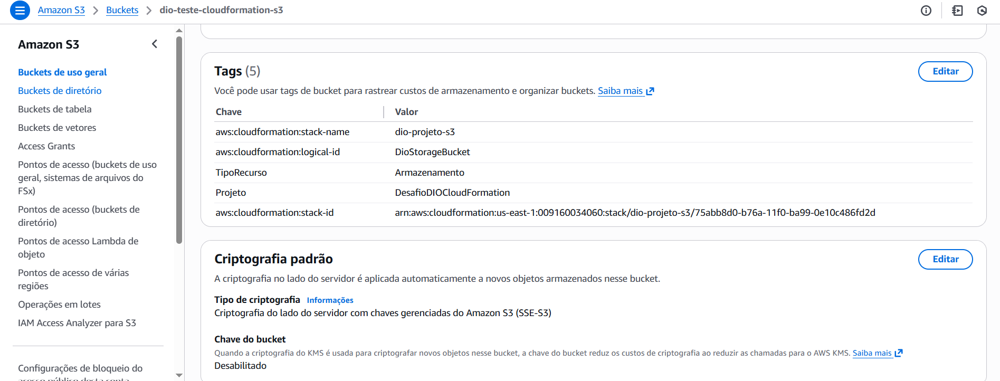

# AWS-CloudFormation2
# Infraestrutura como Código (IaC) - Criação Simples de Bucket S3

## Objetivo do Projeto
Este projeto demonstra o uso do **AWS CloudFormation** para provisionar de forma declarativa um recurso fundamental na AWS: um **Amazon S3 Bucket**.

---

## Detalhes do Template (`s3-template.yaml`)

| Seção | Função | Detalhes no Código |
| :--- | :--- | :--- |
| **`Parameters`** | Define o **BucketName** como entrada do usuário para o nome do Bucket, permitindo reuso. | O valor padrão é `dio-teste-cloudformation-s3`. |
| **`Resources`** | Cria o recurso **`AWS::S3::Bucket`** (`DioStorageBucket`). | Define o controle de acesso como `Private` e adiciona **Tags** de Projeto. |
| **`Outputs`** | Exibe o nome final do Bucket criado. | Essencial para verificar o sucesso da Stack. |

---

##  Como Executar o Teste (Implantação)

Siga estas instruções no **Console da AWS** (serviço CloudFormation):

### 1. Preparação
1.  Navegue até o serviço **CloudFormation** na sua conta AWS.
2.  Clique em **"Create stack"** e faça o upload do arquivo **`s3-template.yaml`**.

### 2. Configuração (Atenção ao Nome)
1.  **Stack name:** Defina um nome para a Stack (Ex: `DIO-S3-Stack`).
2.  **BucketName (Parâmetro):** O valor padrão é `dio-teste-cloudformation-s3`. **"Nome ÚNICO"**

### 3. Finalização e Verificação
1.  Prossiga com as telas, marque a caixa de confirmação e clique em **"Submit"**.
2.  Monitore a aba **Events** até ver o status **`CREATE_COMPLETE`**.

### 4. Evidência de Criação e Configuração do Bucket S3

Esta imagem, obtida diretamente do Console do Amazon S3, comprova a criação do Bucket (`dio-teste-cloudformation-s3`) e valida que as **Tags** e as configurações de segurança (Criptografia padrão) foram aplicadas corretamente pelo template do CloudFormation.

### 5. Limpeza (Obrigatória)
* Selecione a Stack e clique em **"Delete"** para remover o Bucket S3 e evitar cobranças.
